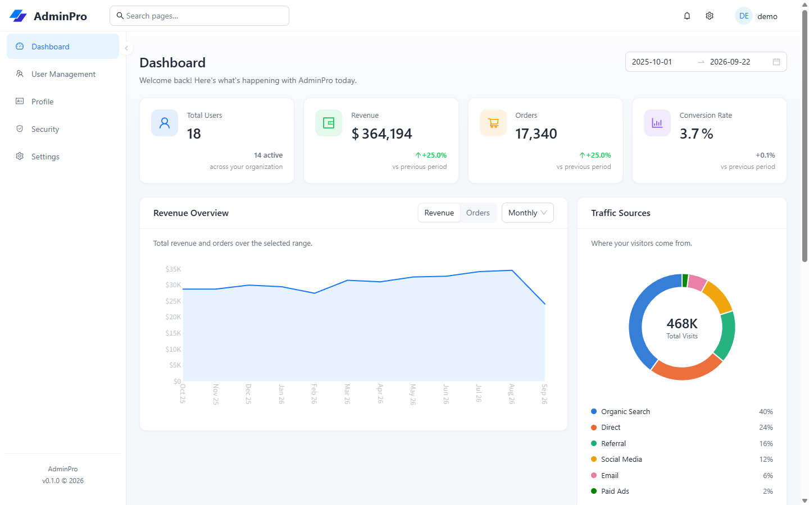

# Ant Design Admin Boilerplate

Vite + React 19 + Ant Design 5 admin starter with Pro Components. Every data call is mocked in memory, so it runs with no backend.



## Highlights

- Responsive ProLayout shell with sidebar, mixed, and top navigation modes.
- Live template customizer for light/dark mode, preset or custom brand colors, and layout selection.
- Dashboard metrics, accessible chart data, recent orders, tasks, and calendar views.
- User management, profile, security, and organization settings flows backed by deterministic mock data.
- Browser-persisted appearance and preferences with no backend required.

## Requirements

- Node.js `^20.19` or `>=22.12` (required by Vite 8)
- pnpm 11 — `corepack enable` picks up the version pinned in `package.json`

## Getting started

```bash
pnpm install
pnpm dev
```

Open the printed URL, then sign in with any valid email and a password of at least six characters. No credentials are checked.

## Scripts

| Script              | What it does                       |
| ------------------- | ---------------------------------- |
| `pnpm dev`          | Vite dev server with HMR           |
| `pnpm build`        | Type-check, then build to `dist/`  |
| `pnpm preview`      | Serve the built `dist/` locally    |
| `pnpm type-check`   | `tsc --noEmit`                     |
| `pnpm lint`         | ESLint over the repo               |
| `pnpm lint:fix`     | ESLint with autofix                |
| `pnpm format`       | Prettier, writing changes          |
| `pnpm format:check` | Prettier, check only (CI-friendly) |

`pnpm build` runs `tsc --noEmit` first, so type errors fail the build.

## How it fits together

### Data flows through three layers

1. `src/mocks/api.ts` — the only stateful module. The `users` array lives in memory, every call resolves after 250 ms, nothing touches the network.
2. `src/api/modules/*.api.ts` — adapters that call the mock and shape the result into `PaginatedResponse<T>`.
3. Pages — import from `@/api/modules/*`, never from the mock directly.

To use a real backend, rewrite layer 2 and keep the `PaginatedResponse<T>` contract. `useProTable` and the tables keep working unchanged.

### Routes are declared once

`src/routes/routeDefinitions.tsx` holds `protectedRoutes` and `authRoutes`, all lazy-loaded. `src/routes/index.tsx` turns them into `<Routes>`; `src/layouts/MainLayout.tsx` independently reads `protectedRoutes` to build the sidebar. Adding a page means adding one entry to that file.

Paths are relative (`users`, not `/users`) because they nest under a layout route; `MainLayout` re-prefixes them with `/` for menu keys. `AuthGuard` wraps the whole authenticated branch and redirects to `/login` when there is no user.

### Auth is a stub

`src/contexts/AuthContext.tsx` keeps `{ name, email }` in `sessionStorage` — no token, no server call, no role enforcement. `UserRole` exists only for display. Replace the context when you add real auth.

### Screens

Dashboard, User Management, Profile, Security and Settings are implemented. `Role Management` and `Permission` appear in the design but have no spec and no route — they were left out rather than shipped as empty pages.

### Local state, and what is deliberately not wired

`src/contexts/SettingsContext.tsx` holds branding and preferences in `localStorage` — theme, primary color, layout, logo, landing page, table density, and notification switches. The header's template customizer applies and persists appearance changes immediately. `GeneralTab` and `PreferencesTab` stage their form edits through `preview()` and only `save()` writes them; `cancel()` rolls back. Keys are validated on read by `readPreferences` in `src/utils/storage.ts`, which drops anything that is not a known key with the right type — a new persisted setting has to be added to `DEFAULT_SETTINGS` or it will silently disappear.

Profile data persists separately under `STORAGE_KEYS.PROFILE`. Changing a password, enabling 2FA, removing a device, signing out other sessions, connecting an integration, billing and account deletion all need a server, so they explain that and refuse — none of them report success. Keep that property when touching those screens: a demo that fakes a password change teaches the wrong thing.

### Tables

`src/hooks/useProTable.ts` centralizes the ProTable setup — pagination, search, toolbar options, `PaginatedResponse` unwrapping — and reads `message` from `App.useApp()` so toasts inherit the configured theme. Use it for new list screens. Columns for the users table live in `src/pages/users/UserColumn.tsx`.

### Charts

The dashboard plots revenue and orders over the selected range, plus traffic by source. The numbers come from a seeded 365-day series in `src/mocks/api.ts`, so the KPIs (and their change against the previous equal-length window) are computed rather than hardcoded, and reloading does not reshuffle them.

Charts use `@ant-design/plots`. Each one is a small component in `src/pages/dashboard/` that owns its mark spec, and every chart is paired with `ChartDataTable` — a `.sr-only` table holding the same numbers, because a tooltip must never be the only way to read a value. Colours come from `CHART_TOKENS` in `src/constants/app.ts`: the area chart plots one measure, so it uses the single brand hue; the donut encodes identity, so it uses `CHART_TOKENS.categorical`, a fixed six-hue order validated for colour-vision separation against both card surfaces. Assign those hues in order and never cycle them.

Entry animation is off. It is decorative, and G2 does not honour `prefers-reduced-motion`.

## Theming

The header settings button opens a template customizer that previews and persists light/dark mode, the primary color, and the ProLayout mode. The full Settings page remains available from the avatar menu for organization-level preferences.

For static defaults and rebranding, update these two sources:

- `src/constants/app.ts` — `APP_CONFIG` (name, logo, version, brand colors) plus `appTheme`, the Ant Design `ThemeConfig` passed to `ConfigProvider`. This is the rebrand entry point, and `CHART_TOKENS` below it reads `series` from the same primary color. If you change that color, re-check the chart hue against the white card surface for contrast — an accent that works as a button fill does not automatically work as a 2px line.
- `src/styles/variables.less` — LESS variables duplicating the palette for hand-written CSS.

`src/styles/index.less` is the only stylesheet entry point, imported once in `src/main.tsx`. It imports `variables.less` first; the other partials depend on that ordering and do not import variables themselves, so keep new `@import` lines below it.

`@/` resolves to `src/` and is declared in both `vite.config.ts` and `tsconfig.json`.

## Code style

Prettier owns formatting, ESLint owns correctness, `.editorconfig` covers editors that read neither. `pnpm format` and `pnpm lint:fix` fix most issues in place.

ESLint runs typescript-eslint's type-checked rules, so floating promises, misused promises in handlers, and hook dependency mistakes are caught statically. Two deliberate rule adjustments live in `eslint.config.js`, each with a comment explaining why.

## Known gaps

- No test runner and no CI configuration.
- No error boundary — an unexpected render error blanks the page.
- The mock `users` array is module state, so it is shared across tabs and reset on reload.
